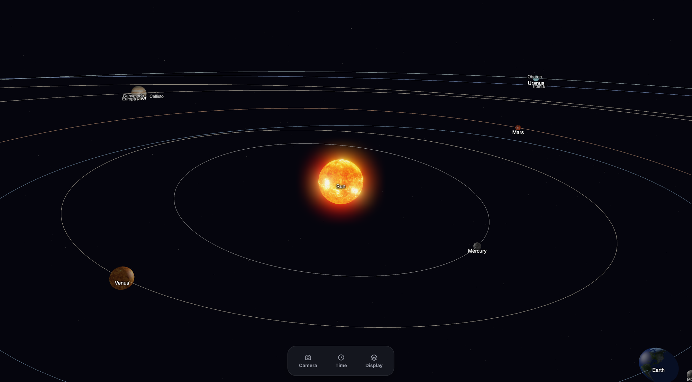

# To Boldly Glow



To Boldly Glow is a free, open-source, browser-based planetarium and solar-system visualizer. It
renders the Sun, all 8 planets, and 9 major moons in 3D using real orbital mechanics (VSOP87
planetary theory) and real axial tilts, with accurate positions for any date — not just today.
Fly around freely or lock the camera onto any body, run time forwards or backwards from real-time
up to years per second, and blend between true-to-scale distances and a compressed, easier-to-explore
view. Everything renders through WebGPU, with HDR bloom, lens flares, and a real ~9,100-star
background sourced from the Yale Bright Star Catalogue.

- [Roadmap](docs/roadmap.md) — features named for future phases (seasons, moon phases, eclipses,
  satellites/probes, a speed-of-light calculator, gravitational field visualization, and more).
- [Changelog](CHANGELOG.md) — what's shipped so far.
- [Credits](CREDITS.md) — third-party data and library attributions.

Licensed under the [MIT License](LICENSE).

## For users

There's no hosted build yet, so running it locally is currently the only way to try it.

### Getting it running

1. Install [Node.js](https://nodejs.org/) 20 or later (see `.nvmrc`).
2. Clone the repository and install dependencies:
   ```sh
   git clone https://github.com/bjblazko/to-boldly-glow.git
   cd to-boldly-glow
   npm install
   ```
3. Compile the orbital-mechanics engine (its WebAssembly build output isn't checked into git, so
   this is needed once, and again after pulling changes to `packages/engine`):
   ```sh
   npm run build --workspace=@toboldlyglow/engine
   ```
4. Start the app:
   ```sh
   npm run dev --workspace=@toboldlyglow/app
   ```
5. Open the printed local URL (usually `http://localhost:5173`) in a **WebGPU-capable browser** —
   a current version of Chrome or Edge. There's no WebGL fallback: unsupported browsers will show a
   plain "unsupported browser" message instead of the scene.

### Using the app

- **Camera** — by default, drag to orbit the current target and scroll (or pinch) to zoom. Use the
  **Camera** panel (bottom dock) to switch to free-fly mode, where dragging looks around and
  `W`/`A`/`S`/`D` moves forward/back/strafe. The same panel has a search box — type a body's name,
  then press Enter or click a result to fly the camera to it and lock on; a "Following: …" chip
  appears with a **×** to stop following and return to free manual control.
- **Time** — the **Time** panel has play/pause, a reverse-direction button, and rate presets
  (real-time up to a year per second). The shuttle slider lets you dial in a rate directly: the
  center tick is zero (the clock is stopped), the left half rewinds, the right half fast-forwards
  — the fill color and the Past/Future labels show which side you're on. The same panel has the
  Realistic ⇄ Explorer slider, which blends between true-to-scale distances/sizes and a compressed
  view that's easier to fly around in, and the current simulated date/time (UTC).
- **Display** — the **Display** panel toggles orbit paths, name labels, the starfield, HDR bloom,
  lens flares, and moons independently.

## For developers

### Requirements

- Node.js 20 or later (`.nvmrc` pins the version; `npm install` at the repo root installs
  everything else, including AssemblyScript's `asc` compiler — no separate toolchain to set up).
- A WebGPU-capable browser (current Chrome/Edge) for running the app in dev mode and for the
  Playwright e2e suite. WebGPU-only is a deliberate MVP decision — see the "WebGL2 fallback" entry
  in [the roadmap](docs/roadmap.md) for the reasoning and what revisiting it would take.

### Project structure

This is an npm-workspaces monorepo with three packages:

- **`packages/engine`** — AssemblyScript. The pure numeric orbital-mechanics core (VSOP87
  planetary positions, Julian Day conversion, and similar), compiled to WebAssembly. Fully
  unit-testable without a browser or GPU.
- **`packages/app`** — TypeScript, built with Vite. The WebGPU renderer, camera/time controllers,
  and UI (`packages/app/src/hud`). This is the actual application.
- **`packages/data-pipeline`** — TypeScript. Offline conversion scripts (e.g. turning the Yale
  Bright Star Catalogue into the binary starfield asset `packages/app` loads at runtime). Not part
  of the normal dev loop — only run when source data changes.

### Setup

```sh
git clone https://github.com/bjblazko/to-boldly-glow.git
cd to-boldly-glow
npm install
npm run build --workspace=@toboldlyglow/engine   # compiles the WASM engine (build/ is gitignored)
npm run dev --workspace=@toboldlyglow/app        # Vite dev server with hot reload
```

### Common tasks

Run from the repo root:

| Command | What it does |
| --- | --- |
| `npm run dev --workspace=@toboldlyglow/app` | Dev server with hot reload |
| `npm run build` | Builds the engine, then the app, for production |
| `npm test` | Unit tests across all three packages (Vitest) |
| `npm run test:e2e` | Builds the app, then runs the Playwright e2e suite in a real browser |
| `npm run typecheck` | `tsc --noEmit` for the app |
| `npm run lint` | ESLint across the whole repo |

### Documentation

- [MVP Design Specification](docs/superpowers/specs/2026-07-17-to-boldly-glow-mvp-design.md) — the
  current, implementation-ready design.
- [Roadmap](docs/roadmap.md) — deferred features, each with just enough detail to pick up later.
- [Changelog](CHANGELOG.md) — what's shipped, in [Keep a Changelog](https://keepachangelog.com/)
  format.
- [Credits](CREDITS.md) — data and library attributions; check here before adding new third-party
  data or assets, and add to it when you do.
