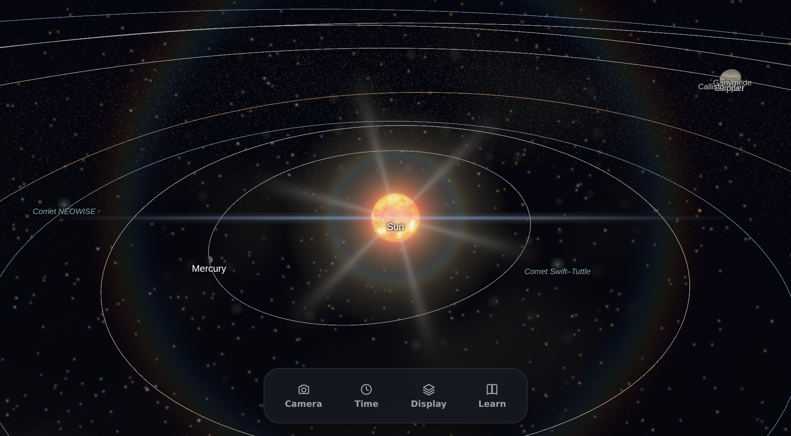

# To Boldly Glow



To Boldly Glow is a free, open-source, browser-based planetarium and solar-system visualizer. It
renders the Sun, all 8 planets, and 9 major moons in 3D using real orbital mechanics (VSOP87
planetary theory) and real axial tilts, with accurate positions for any date — not just today —
along with the asteroid and Kuiper belts, notable comets and dwarf planets on their orbits. Fly
around freely like in a space game or lock the camera onto any body, run time forwards or backwards
from real-time up to years per second, and blend between true-to-scale distances and a compressed,
easier-to-explore view. Everything renders through WebGPU, with HDR bloom, lens flares, the Milky
Way, and a real ~9,100-star background in the stars' own colors from the Yale Bright Star
Catalogue.

**Try it live: [huepattl.de/products/to-boldly-glow](https://huepattl.de/products/to-boldly-glow)**
(needs a browser with WebGPU, such as a current Chrome, Edge or Safari).

- [Roadmap](docs/roadmap.md) — features named for future phases (seasons, moon phases, eclipses,
  satellites/probes, a speed-of-light calculator, gravitational field visualization, and more).
- [Changelog](CHANGELOG.md) — what's shipped so far.
- [Credits](CREDITS.md) — third-party data and library attributions.

Licensed under the [MIT License](LICENSE).

## For users

The quickest way to try it is the [live version](https://huepattl.de/products/to-boldly-glow). To run
it yourself, or to work on it:

### Getting it running

1. Install [Node.js](https://nodejs.org/) 22.12 or later (`.nvmrc` pins the version CI uses).
2. Clone the repository and install dependencies:
   ```sh
   git clone https://github.com/bjblazko/to-boldly-glow.git
   cd to-boldly-glow
   npm install
   ```
3. Compile the orbital-mechanics engine (its WebAssembly build output isn't checked into git, so
   this is needed once, and again after pulling changes to `packages/engine`):
   ```sh
   npm run build --workspace=@toboldlyglow/engine
   ```
4. Start the app:
   ```sh
   npm run dev --workspace=@toboldlyglow/app
   ```
5. Open the printed local URL (usually `http://localhost:5173`) in a **WebGPU-capable browser** —
   a current version of Chrome or Edge. There's no WebGL fallback: unsupported browsers will show a
   plain "unsupported browser" message instead of the scene.

### Using the app

- **Camera** — by default, drag to orbit the current target (it keeps turning a little when you let
  go), scroll or pinch to zoom; `W`/`A`/`S`/`D` or the arrow keys turn the view and `R`/`F` zoom.
  Double-click (or double-tap) any planet, moon, comet or dwarf planet to fly there and follow it.
  Use the **Camera** panel (bottom dock) to switch to free flight, flown like a spaceship in a game:
  `W`/`S` (or `↑`/`↓`) thrust forward/back, `A`/`D` (or `←`/`→`) strafe, `R`/`F` rise/sink, `Q`/`E`
  roll, `Shift` boosts, drag to look around and scroll to set the speed. The ship eases in and out of
  motion, slows down near planets and speeds up in open space (so the same keys work at every
  scale), stops at a planet's surface instead of flying through it, and levels itself with the
  ecliptic when you stop rolling. On a touch screen, free flight shows a thumbstick (fly and strafe)
  and buttons to rise, sink and boost; drag anywhere else to look around, pinch to set the speed. A
  short hint at the top of the screen recalls the controls whenever you switch. The same
  panel has **Start Tour**, an endless autopilot flight past every planet, flown like a spaceship —
  it accelerates, brakes on arrival, banks into turns and circles each planet once (any camera input
  hands control back, exactly where the tour was), and a search box — type a body's name (planets,
  moons, comets like Halley or Encke, Ceres, Vesta, Pallas, Pluto), then press Enter or click a result to fly
  the camera to it and lock on; a "Following: …" chip appears with a **×** to stop following and
  return to free manual control.
- **Time** — the **Time** panel has play/pause, a reverse-direction button, and rate presets
  (real-time up to a year per second). The shuttle slider lets you dial in a rate directly: the
  center tick is zero (the clock is stopped), the left half rewinds, the right half fast-forwards
  — the fill color and the Past/Future labels show which side you're on. The panel also shows the
  current simulated date/time (UTC).
- **Display** — the **Display** panel switches between **Realistic** (true-to-scale distances and
  sizes) and **Compact** (a compressed view that's easier to fly around in), and toggles planet
  orbits, comet and dwarf-planet orbits, name labels, the stars (in their real colors), the Milky Way
  (with its nebulae and the nearest galaxies), the asteroid and Kuiper belts, comets, Earth's
  clouds, HDR bloom, lens flares, and moons independently. **Filmic look** (off by default) renders
  the picture's colors like film (AgX tonemapping): the Sun burns out to white-hot instead of
  staying a saturated orange, and the sky goes deep black.
- **Things to look for** — fly behind Earth (or the Moon) until it covers the Sun: the exposure
  opens up and the Sun's corona appears in full, with its streamers and the red prominences at the
  limb. Earth's night side shows its city lights, and the aurora glows around both poles — best seen
  at the limb, or looking down on a pole from the night side.

### Where the data and images come from

Everything shown is either real, openly licensed data or made for this project — no image or data
set is used without a license that allows it. In short (full attributions, file lists and license
texts are in [CREDITS.md](CREDITS.md)):

| What | Source | License |
| --- | --- | --- |
| Textures of the Sun, the planets, the Moon and Saturn's rings | [Solar System Scope](https://www.solarsystemscope.com/textures/) | CC BY 4.0 |
| Textures of Io, Europa, Ganymede, Callisto and Titan | NASA / JPL / USGS imagery (Voyager, Galileo, Cassini), via Wikimedia Commons | Public domain |
| Gas giants' bump maps | Derived from the Solar System Scope textures by `packages/data-pipeline` | CC BY 4.0 (inherited) |
| Planet positions | VSOP87 theory (Bureau des Longitudes), coefficients from the [astronomia](https://github.com/commenthol/astronomia) library | MIT |
| Rotation axes of the Sun and planets | IAU Working Group on Cartographic Coordinates and Rotational Elements (2015 report) | Published facts |
| Moon orbits | Published orbital elements (JPL/IAU) | Published facts |
| Stars: positions, brightness, colors (B−V) | [Yale Bright Star Catalogue, 5th ed.](https://cdsarc.cds.unistra.fr/ftp/V/50/) (Hoffleit & Warren, via CDS) | Public domain |
| Star colors from B−V | Formulas of Ballesteros (2012) and Kang et al. (2002) | Published formulas |
| Milky Way, nebulae, nearby galaxies | Painted procedurally for this project (`npm run paint-sky`); object positions from the NGC/IC, Sharpless and Lynds catalogs | Original, MIT |
| The Sun's limb darkening (per color) and granulation size and lifetime | Allen's Astrophysical Quantities; solar physics literature | Published facts |
| Comets, Ceres, Vesta, Pallas, Pluto | Orbital elements as published by the JPL Small-Body Database and the Minor Planet Center | Published facts |
| Asteroid and Kuiper belt populations | Generated from the populations' published statistics (no individual catalogued objects) | Original, MIT |
| Earth's clouds | Procedural, made for this project | Original, MIT |
| Earth's city lights | NASA Earth Observatory's "Earth at Night" 2012 (Black Marble; Suomi NPP VIIRS data, NOAA NGDC), from NASA WorldWind's npm package; lights extracted by `packages/data-pipeline` | Public domain |
| Earth's aurora | Procedural; the ovals' place around the IGRF-14 geomagnetic poles and their published geomagnetic latitudes and heights | Original, MIT |
| The Sun's corona, chromosphere and prominences | Procedural; brightness profile from Baumbach's K-corona fit, heights from solar physics literature | Original, MIT |

## For developers

### Requirements

- Node.js 22.12 or later (`.nvmrc` pins the version CI uses; `npm install` at the repo root installs
  everything else, including AssemblyScript's `asc` compiler — no separate toolchain to set up).
- A WebGPU-capable browser (current Chrome/Edge) for running the app in dev mode and for the
  Playwright e2e suite. WebGPU-only is a deliberate MVP decision — see the "WebGL2 fallback" entry
  in [the roadmap](docs/roadmap.md) for the reasoning and what revisiting it would take.

### Project structure

This is an npm-workspaces monorepo with three packages:

- **`packages/engine`** — AssemblyScript. The pure numeric orbital-mechanics core (VSOP87
  planetary positions, Julian Day conversion, and similar), compiled to WebAssembly. Fully
  unit-testable without a browser or GPU.
- **`packages/app`** — TypeScript, built with Vite. This is the actual application. Its source is
  grouped by subject, not by technique — each feature keeps its shader, GPU pipeline, per-frame
  uniforms and draw call together:
  - `app/` starts everything and runs the frame loop; `scene/` decides each frame's *scene layout*
    (where every visible body is — the real solar system, or the active lesson's staged scene) and
    renders it.
  - `bodies/` (Sun, planets, moons, their surface materials and Earth's city lights), `sunCorona/`,
    `saturnRing/`, `atmosphereShell/`, `earthClouds/`, `earthAurora/`, `starfield/`, `sky/` (the
    Milky Way backdrop), `smallBodies/` (asteroid belts and comets on Keplerian orbits),
    `orbitPaths/`, `lensFlare/`, `bloom/`, `labels/` — one folder per thing you see.
  - `camera/` (orbit, free flight and their input in `camera/input/`, follow, the tour in
    `camera/tour/`), `learn/` (lessons, with
    `seasons/` and `sizes/`), `hud/`, `time/`, `search/`, `solarSystem/` (body data and orbital
    mechanics).
  - `gpu/` and `lines/` hold the WebGPU plumbing the features share.
- **`packages/data-pipeline`** — TypeScript. Offline conversion scripts (e.g. turning the Yale
  Bright Star Catalogue into the binary starfield asset `packages/app` loads at runtime,
  painting the Milky Way panorama, `npm run paint-sky`, and pulling Earth's city lights out of
  NASA's night image, `npm run extract-city-lights`). Not part
  of the normal dev loop — only run when source data changes.

### Setup

```sh
git clone https://github.com/bjblazko/to-boldly-glow.git
cd to-boldly-glow
npm install
npm run build --workspace=@toboldlyglow/engine   # compiles the WASM engine (build/ is gitignored)
npm run dev --workspace=@toboldlyglow/app        # Vite dev server with hot reload
```

### Common tasks

Run from the repo root:

| Command | What it does |
| --- | --- |
| `npm run dev --workspace=@toboldlyglow/app` | Dev server with hot reload |
| `npm run build` | Builds the engine, then the app, for production |
| `npm test` | Unit tests across all three packages (Vitest) |
| `npm run test:e2e` | Builds the app, then runs the Playwright e2e suite in a real browser |
| `npm run typecheck` | `tsc --noEmit` for the app, its unit tests and e2e specs |
| `npm run lint` | ESLint across the whole repo, including type-aware rules and clean-code limits |

Production code is held to clean-code limits by ESLint (see `eslint.config.js`): cyclomatic
complexity at most 8, functions at most 40 lines and 15 statements, at most 4 parameters, nesting at
most 3 deep, files at most 300 lines. When a function outgrows them, split it along what it does.

### Documentation

- [MVP Design Specification](docs/superpowers/specs/2026-07-17-to-boldly-glow-mvp-design.md) — the
  current, implementation-ready design.
- [Roadmap](docs/roadmap.md) — deferred features, each with just enough detail to pick up later.
- [Changelog](CHANGELOG.md) — what's shipped, in [Keep a Changelog](https://keepachangelog.com/)
  format.
- [Credits](CREDITS.md) — data and library attributions; check here before adding new third-party
  data or assets, and add to it when you do.
